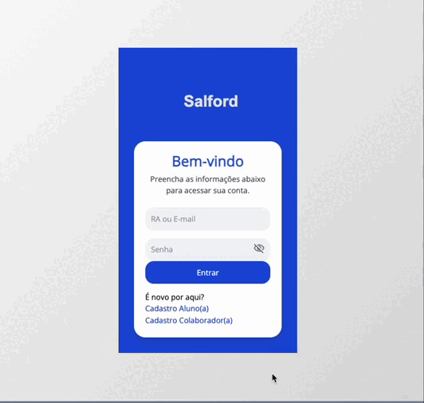

# Salford Sistemas

Projeto simples em HTML e CSS para a disciplina de Desenvolvimento de Sistemas WEB III na Faculdade e Escola Técnica QI.

---



---

### Como Clonar este Repositório

Para clonar este repositório em sua máquina local, siga os passos abaixo:

1. **Instale o Git**  
   Se ainda não tiver o Git instalado, baixe e instale-o em [git-scm.com](https://git-scm.com/).

2. **Clone o Repositório**  
   Copie a URL do repositório (clique no botão **"Code"** e depois em **"HTTPS"** ou **"SSH"**) e execute o seguinte comando no seu terminal:

   ```bash
   git clone https://github.com/usuario/repositorio.git
   ```

   Substitua `https://github.com/usuario/repositorio.git` pela URL do repositório.

3. **Entre no Diretório do Projeto**  
   Após clonar o repositório, entre no diretório do projeto com o comando:

   ```bash
   cd repositorio
   ```

   Substitua "repositorio" pelo nome do diretório clonado.
